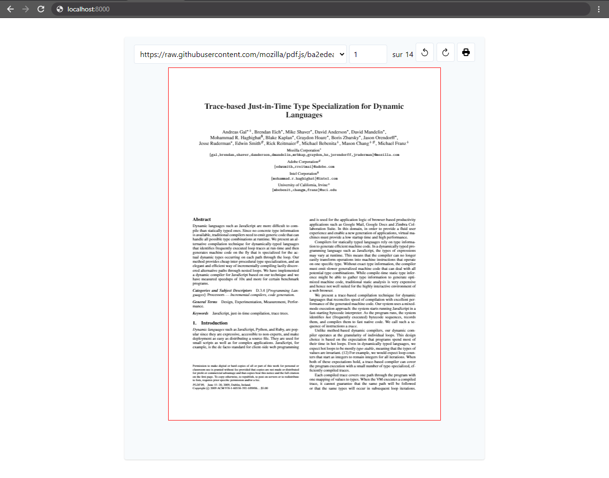

# About
The goal of this is to test if i can show a pdf file on **PC** and **smartphone** and past it in **base64**

## Based on
- **nuxtjs**
- **tailwindcss**
- **vue-pdf**

**nuxtjs** for the base application \
**tailwindcss** for the css style \
**vue-pdf** to show show the pdf file

vue-pdf come from the github repository of FranckFreiburger :\
 https://github.com/FranckFreiburger/vue-pdf

## Build Setup

```bash
# install dependencies
$ npm install

# serve with hot reload at localhost:3000
$ npm run dev

# build for production and launch server
$ npm run build
$ npm run start

# generate static project
$ npm run generate
```

## Picture of the vue



## Link & Doc

For detailed explanation on how **Nuxtjs** work, check out [Nuxt.js docs](https://nuxtjs.org).

For detailed explanation on how **vue-pdf** work, check out the git repository [pdf-vue of Franck Freiburger]( https://github.com/FranckFreiburger/vue-pdf).

For detailed explanation on how **tailwindcss** work, check out [tailwindcss docs](https://tailwindcss.com/docs).
